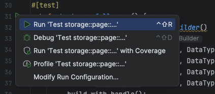
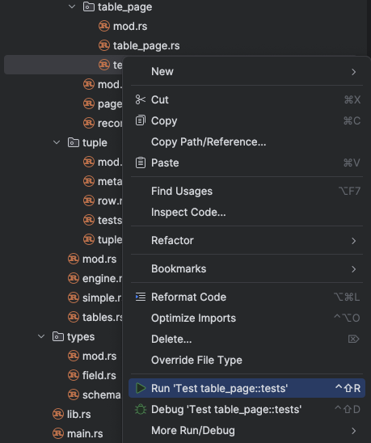
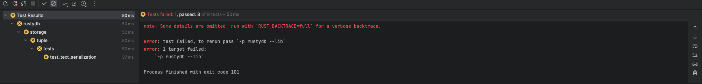

# Lab 3: Database Operators

In this lab we will be implementing the core operators that make up our RustyDB engine. It will include:

* Create and Delete Table
* Scan Table
* Insert/Delete/Update Tuples
* Projection
* Filter
* Join
* Aggregate

## Getting Started

Download the starter code from [Canvas](https://canvas.northwestern.edu/files/20271239/download?download_frd=1). This
link is also included in the Canvas assignment.

Copy your solution files from Lab 2 into the new project tree in the paths below. They are:

* `row.rs` --> `src/storage/tuple/row.rs`
* `table_page.rs` --> `src/storage/page/table_page/table_page.rs`
* `buffer_pool_manager.rs` --> `src/storage/buffer/buffer_pool_manager/buffer_pool_manager.rs`
* `lru_k_replacer.rs` --> `src/storage/buffer/lru_k_replacer/lru_k_replacer.rs`

## Setup

Next set up RustRover in this new project directory by repeating the setup steps from Lab 2. They are copied below for
convenience.

### Install Rust

The first thing would always to [install](https://www.rust-lang.org/tools/install) Rust and its build tool Cargo. If
this is your first time working with Rust, we highly recommend glancing through
the [Rust Book](https://doc.rust-lang.org/book/)
to gain a general understanding of the language.

### Configuring Your IDE

IDEs (Integrated Development Environments) are graphical software development environments that can help you manage
larger projects. For Rusty-DB, we strongly recommend using RustRover.

RustRover is a dedicated Rust IDE developed by JetBrains, offering powerful features specifically tailored for Rust
development. You can find installation
instruction [here](https://www.jetbrains.com/help/rust/installation-guide.html#-nhkivi_144).

Finally, to work with Rusty-DB, click Open and navigate to the folder where you have stored the project. It will load
the project and display the code. RustRover may ask you if you
to [trust the project](https://www.jetbrains.com/help/rust/project-security.html#projects_security)
when you first open it. Select "Trust Project" to enable full access to RustRover's features for this project.

### Testing Your Code

We've given some example tests under the `tests.rs` file within each module. These tests will not pass until their
corresponding code has been completed. These tests are by no means comprehensive. Thus, we expect you to create some
tests to verify your code.

There are two main ways to run tests for Rusty-DB: using RustRover's built-in test runner or using Cargo commands.
Both methods are effective, so choose the one that best fits your workflow.

Using RustRover:

To run a single test: Place your cursor on the test method and press Ctrl+Shift+R. Alternatively,
click the gutter icon next to the test class or test method and select Run '<test name>' from the list.



To run all tests in a folder: Select this folder in the Project tool window and press Ctrl+Shift+R or right-click and
select Run Tests in '[folder name]' from the context menu.



After RustRover finishes running your tests, it shows the results in the Run tool window on the tab for that run
configuration.



Using cargo:

To run a specific test by name:

`cargo test <test_name>`

This will run any test (unit or integration) with a name that matches <test_name>.

To run all tests in a specific module:
`cargo test <module_path>`

Where <module_path> is the full path to the module, using double colons (::) as separators. For example, to run tests
for buffer pool manager, you shall run `cargo test buffer_pool_manager::tests`.

## Background: Query Execution Plan Nodes

We want our database operators to be composable for ad-hoc SQL expressions.   For example, given the query:
```
SELECT a, b
FROM r JOIN s ON r.id = s.id
WHERE r.attr = 7
```
We might compose the following operators:
```
PROJECT(
  JOIN(
      FILTER(r, attr = 7),
      s)
  a, b)
```

Each operator in this plan - such as a join or filter - is represented with an enum named `Node` in RustyDB.  You can check this out in the file `src/sql/planner/plan.rs`.

Each potential operator has assorted fields that parameterize it.  For example, we can sequentially scan a table in the database with:

```
Scan {
        table: Table,
        filter: Option<Expression>,
        alias: Option<String>,
    }
```

This scan tells us the source table we will read.  We will stream its pages through the buffer pool.  The query may also alias the table, e.g., `FROM my_long_table_name AS my_alias`.  We can optionally attach a filter predicate to this plan node with the `filter` field.

## Testing your code

We've provided a couple of test databases with which you can verify your operator implementations.  They are named `POLICE` and `STUDENT`.  We recommend checking them out in `src/sql/mod.rs`.  We demo them in `test_setup_police()` and `test_setup_student()`.  You can craft SQL statements with these and test them against your operator implementations with these simple collections of tables.

To invoke a test over the `POLICE` database, simply create a test that runs:
```
let engine = Local::new(create_storage_engine());
        SqlStudentRunner::new(&engine)
            .initialize(POLICE)
            .select_expect("SELECT * FROM ... WHERE ...", "expected schema; first row; ...; last row");
```

The code for invoking `STUDENT` is the same.  Just change the name of your database in the `initialize` call!  

You can check out the full schemas and starter rows for these databases in `data/test-db/*.sql.`


## Implementing Operators in RustyDB

Each operator will have one or more methods that you will need to implement them.  Each will take a `Rows` object - this is an iterator over a series of rows or `RowIterator`.  We iterate over the rows incrementally to make our solution pipelined and thus scalable to tables that may not fit into RAM.  This input may be from a table, an index or a child operator.

You may find it helpful to check out Rust's [Iterators tutorial](https://doc.rust-lang.org/book/ch13-02-iterators.html) and/or  [iterator.rs](https://doc.rust-lang.org/nightly/core/iter/trait.Iterator.html) documentation for examples of how to implement this pattern.

After implementing your operator, we will also ask you to connect it into the end-to-end execution engine.  You can do this by invoking your method in the `execute(...)` method in `src/sql/execution/execute.rs`.  There you will see conditions for each major operator, e.g., selection, projection, join, sorting, and aggregation.  The call to your method will itself return a `Rows` object for its parent operator - or to output to the client if it is the root of the operator tree.

### Exercise 1: Create, Delete, and Scan Table

First, we will create a table.  We will need to register it with the system catalog and report any error conditions (such as if a table by this name already exists).  Put your code in `src/sql/engine/local.rs:create_table`.  

*Hint: You may want to reference the `self.txn` method that comes with this class to make sure your code is correct and complete.*

You should also fill in the entries for `drop_table` and `get_table` in the same file.  

Integrate your code into the engine by invoking it in the `execute_plan` function in `src/sql/execution/execute.rs`.

### Exercise 2: Insert, Update, and Delete Rows

Now we are ready to start manipulating the tables we created in our system catalog.   We will do this in `src/sql/execution/write.rs`.  

To insert rows, please implement the method `insert(txn: &impl Transaction, table: Table, source: Rows)`.   Returns a vector of `RecordId`s corresponding to the rows created with `source`.  Use the provided `txn` to provide a context within which to execute your modifications to the database safely.  You do not need to worry about implementing concurrency control (safe interleaving of reads and writes among multiple workers) for this assignment.

Implement similar methods for `delete` and `update` in the same file.

Start testing your code with the following methods in `src/sql/tests/lab3_student_tests.rs`:
* test_insert
* test_insert_bulk
* test_delete
* test_update_expression
* test_update_datatypes

This file will contain all of our subsequent example tests. As always, we encourage you to write additional tests to verify your code.


### Exercise 3: Filter

We can set the filter up as its own plan node. For example, if our query includes a `HAVING` clause, we will select rows over the output of an aggregate.  It also implements the `WHERE` clause of our queries.

Please implement a filter in `src/sql/execution/transform.rs` by filling in the following method:
```
pub fn filter(source: Rows, predicate: Expression) -> Rows {
...
}
```

Don't forget to integrate your code into the execution engine in `src/sql/execution.rs`.

With `test_where()` and `test_update_where()` in the student test suite, you can start testing your implementation to see if you are on the right track.


### Exercise 4: Projection

For projection, there are essentially three things that your operator may do: 1) reorder columns, 2) delete columns, 3) create new columns by applying expressions.

We can construct all of these transformations by supplying a vector of expressions.  For expressions referencing a column from the input schema, the output column will simply copy the contents of its input for all rows.  Please implement your projection in `src/sql/execution/transform.rs` in the method:

```
pub fn project(source: Rows, expressions: Vec<Expression>) -> Rows {
...
}
```

**Note: You do not need to implement the expressions referenced in `project`.**  Working implementations of these are provided in the starter code.

Also, please connect your `project` method with the caller in `src/sql/execution.rs`.

In the student tests file, you can test your projection with `test_select*`.


### Exercise 5: Limit

Next, let's implement our SQL engine's `LIMIT` clause.   This is typically paired with a sort so the engine can implement top-k queries.  Recall that this class of queries answers questions such as, "Give me the top 3 students as sorted by height".  You can implement this in `transform.rs:limit`.  

Hint: Are there any methods in the source iterator that might help with this?

Recall that we're continuing to integrate our new methods into `execute.rs`.

You can start testing your implementation with the `test_limit` method.

### Exercise 6: Nested Loop Join

We are now ready to implement a nested loop join in RustyDB.  The skeleton code for this is in `src/sql/execution/join.rs`.  We now need to maintain two iterators.  One for the `inner` relation that we scan repeatedly.  The second for the `outer` relation that will try all pairs of (`outer`, `inner`) rows to see if the concatenation of the two returns `true` for the join predicate, `expression`.  

Keep an eye on the `outer` flag. When it is set, we are doing a `LEFT` join.  You might find this diagram of [join types](https://stackoverflow.com/questions/13997365/sql-joins-as-venn-diagram) useful for visualizing this.

Start testing your code with `test_scan_with_join`

### Exercise 7: Aggregators

Our last task is to implement aggregation.  We are handling the grouping and tuple iteration for this operator.  Your goal is to implement the accumulators that will calculate the aggregate.  It may do this once for the entire select statement (e.g., `SELECT COUNT(*) FROM ...`) or with a group-by aggregate.  Again, you don't need to worry about this part.

Implement the accumulators in the `Aggregator` code available in `src/sql/execution/aggregate.rs`.  The comments of this file provide a detailed outline of how to tackle this.

You can begin to test your code with:
* `test_aggregate_basic`
* `test_aggregate_constant`
## Submitting your code with Gradescope

Please send in your lab code (paired with your four files from Lab 2 listed in [Getting Started](#getting-started) to the Gradescope assignment linked in the [Canvas Assignment](https://canvas.northwestern.edu/courses/217304/assignments/1486181).

You will want to include:
* `src/sql/execution/execute.rs`
* `src/sql/execution/transform.rs`
* `src/sql/engine/local.rs`
* `src/sql/execution/join.rs`
* `src/sql/execution/write.rs`
* `src/sql/execution/aggregate.rs`
* `src/sql/execution/source.rs`

We've created a shell script that will put all of your code into a single directory.  From the terminal in Rust Rover, if you run `bash create_handin.sh` it will create a new directory named `handin` and copy the 10 files you need into it for easy checkins with Gradescope.
