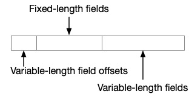
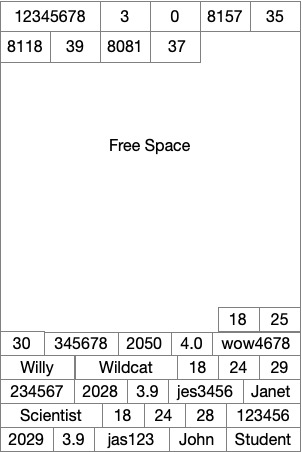

# Lab 2: Storage Manager

## 1. Introduction

In this lab students will implement a simplified storage back-end for RustDB. First you will pack tuples into pages and
pages into a heap file. After that, we will implement the buffer pool for maintaining the DBMS's state, i.e., its in-memory
pages.

In each part of the lab, you will implement a module and we provide some tests demonstrate how to
check your work. You should also write your own tests to ensure your implementation is correct. We will be grading this
with a set of private tests in Gradescope. You may resubmit your hand-in as many times as you wish for feedback before the deadline.

## 2. Setup

### 2.1 Install Rust

The first thing would always to [install](https://www.rust-lang.org/tools/install) Rust and its build tool Cargo. If
this is your first time working with Rust, we highly recommend glancing through the [Rust Book](https://doc.rust-lang.org/book/)
to gain a general understanding of the language.

### 2.2 Configuring Your IDE

IDEs (Integrated Development Environments) are graphical software development environments that can help you manage 
larger projects. For RustDB, we strongly recommend using RustRover. 

RustRover is an IDE from JetBrains, offering powerful features specifically tailored for Rust 
development. You can find installation instruction [here](https://www.jetbrains.com/help/rust/installation-guide.html).

Finally, to work with RustDB, click Open and navigate to the folder where you stored the starter code. It will load 
the project and display the code. RustRover may ask you if you to [trust the project](https://www.jetbrains.com/help/rust/project-security.html#projects_security)
when you first open it. Select "Trust Project" to enable full access to RustRover's features.

**A note on AI tools** We acknowledge that many students come to this class with limited exposure to Rust.  That's ok, you are welcome to learn as you go.  If you have prior experience with C/C++ or Java, many of the object-oriented features will be familiar to you.  We are ok with you sketching out your solutions to the lab in pseudocode or your language of choice and using Copilot or another GenAI coding tool to assist you in translating your ideas to Rust. We think working with these tools is a valuable skill set for work beyond the classroom.   That being said, you are wholly responsible for the contents of your hand-in.  If your code isn't working, then we will award credit accordingly.  If our code similarity checker indicates your code too closely resembles that of another student or resource, we will hold you accountable for that, as described in the syllabus.


### 2.3 Testing Your Code

We've given some example tests under the `tests.rs` file within each module. These tests will not pass until their 
corresponding code has been completed. These tests are by no means comprehensive. Thus, we expect you to create some 
tests to verify your code. 

There are two main ways to run tests for Rusty-DB: using RustRover's built-in test runner or using Cargo commands. 
Both methods are effective, so choose the one that best fits your workflow.

Using RustRover:

To run a single test: Place your cursor on the test method and press Ctrl+Shift+R. Alternatively, 
click the gutter icon next to the test class or test method and select Run '<test name>' from the list.


To run all tests in a folder: Select this folder in the Project tool window and press Ctrl+Shift+R or right-click and 
select Run Tests in '[folder name]' from the context menu.


After RustRover finishes running your tests, it shows the results in the Run tool window on the tab for that run 
configuration. 


Using cargo: 

To run a specific test by name:

`cargo test <test_name>`

This will run any test (unit or integration) with a name that matches <test_name>.

To run all tests in a specific module: 
`cargo test <module_path>`

Where <module_path> is the full path to the module, using double colons (::) as separators. For example, to run tests 
for buffer pool manager, you shall run `cargo test buffer_pool_manager::tests`.

## 3. Heap File Storage

We will now walk through the storage scheme for RustDB's tuples and how we store them in tables with pages.

### 3.1 Tuple Layout

We want to create variable-length tuples with a layout like this:




Assume all ints are 32-bits and floats are 4 bytes long too. We store our strings as variable length strings. For
example, the string “testing” will occupy 7 bytes.

To make finding the serialized data easier, we pack fixed-length fields first after our spec for the lengths of the
variable length ones. Each field length is stored in 2 bytes. We can deduce the length of our last field by looking at
the allocated size of a tuple.

For example, consider the schema:

```student(id int, netid varchar(15), class_year int, gpa float, first_name varchar(25), last_name varchar(25))```

Say that we start with the following rows:

```
(123456, jas123, 2029, 3.9, John, Student)
(234567, jes3456, 2028, 3.9, Janet, Scientist)
(345678, wow4678, 2050, 4.0, Willy, Wildcat)
```

Our tuple layout for the last row would be:


The first 6 bytes give us the offsets for the variable length fields. The next 12 bytes are for the fixed length fields.
The remaining bytes store the text fields.

In RustDB we have a `Tuple` - or a byte array that stores a row's values with the layout above.  A `Tuple` is a logical pointer to an array of bytes that are managed by its parent page. We also have a `Row` - an object that stores a vector of a tuple's fields. The latter is used for evaluating expressions,
such as `student.gpa > 3.0`.

### 3.2 Table Pages

We store batches of these tuples in pages. We will use a fixed page size specified in `common/config.rs`
as `RUSTY_DB_PAGE_SIZE_BYTES`. We will store tuples in a page in this format:


Our header has this setup with their size in bytes in parentheses:


When we insert a tuple, we write to the bytes at the end of the free space. We then append the row's start offset to the
end of the header.

In our running example of three rows above, if our page size is 8192 bytes we would have the following layout for our
page:



#### 3.2.1 Page Layout

Using this page layout, finish implementing the `Page` trait for `TablePage` in `crate/storage/src/page/table_page.rs`,
by coding up:
* `get_tuple`
* `get_next_tuple_offset`
* `insert_tuple`
* `update_tuple_metadata`

The trait definition can be found in `crate/storage/page/page.rs`. You should also write tests to verify that your
implementation works with ad-hoc schemas and tuples. Hint: randomness can help expose bugs in your implementation.

At this point, your code should pass the unit tests in `crate/storage/src/page/table_page.rs`.


## 3.3 LRU-K Replacer

Next we will design, implement, and test an eviction algorithm for your buffer pool. This algorithm will select the page
we will delete from the buffer pool when we need to make more room in the buffer pool to service a new `fetch_page`
request.

We will be implementing a simplified version of
the [LRU-K replacement algorithm](https://www.cs.cmu.edu/~natassa/courses/15-721/papers/p297-o_neil.pdf) for this. This
algorithm keeps track of the last $k$ timestamps at which each page was accessed. It then calculates the $k$-distance as
the difference between `now` and the $k$-th last time it was acessed. For example, if $k=2$, and it was accessed at
timestamps 4 and 2, and our current time is 7, then our $k$-distance is 5. We want to select the evictable frame with
the maximum k distance. If a frame has not been accessed at least $k$ times, it has a $k$ distance of infinity. If
multiple frames have a k distance of infinity, then we want the algorithm to select the evictable frame with the
earliest overall timestamp.

For this, please implement the following methods in `crates/storage/src/replacer/lru_k_replacer.rs`:
* `has_inf_backward_k_dist`
* `get_backwards_k_distance`
* `record_access`
* `pin`
* `unpin`
* `evict`
* `remove`

At this point, your code shall pass the unit tests in this file.

## 3.4. Buffer Pool

Your last task will be to implement our management of the DBMS's in-memory state. We will create a centralized memory
manager that maps the pages from disk into memory so that our database operators can access their contents. The buffer
pool, it maintains a fixed set of pages in memory and orchestrates reading and writing pages to disk.

Our workflow is as follows:


When a query's database operator requests a page, it does so by invoking the buffer pool's `fetch_page_handle` method. This first call coordinates reads and writes to this centralized page cache among multiple, concurrent calls to it. When it is safe, `fetch_page_handle` will call `fetch_page`.  This method will first check to see if the pageis in memory (`frames` in the code).  If it is, then it returns a `PageHandle` that has a pointer to the page's offset in the `frames`.  Otherwise, it dispatches the  disk manager to fetch the page in the heap file on disk for the requested page ID.   We write the page we retrieved to the cache and return a pointer to this position in the buffer pool's fixed memory. 

The calling method, `fetch_page_handle`, wraps this pointer in a `PageFrameRefHandle`.  This object contains metadata to help us manage the lifetime of our pointer to the page frame in `frames`.   If more than one reader requests the same page, both may hold a handle to it. When we fetch a page, we will also pin it in memory. The page will remain in the buffer pool until it is unpinned.  If greater than one operator requests the same page, then each increments the pin count.

When a page's pin count reaches zero, the page becomes unpinned. An unpinned page is eligible for eviction when the
buffer pool is full. When we evict a page, if it is unchanged then we can simply replace it in our in-memory cache. But
if the page has been updated, we will mark it as dirty. All dirty pages must be flushed to their heap file for persistent storage by the
disk manager upon eviction.

#### A word on PageHandles

To enable multiple readers and writers to access the same buffer pool at the same time, we need a layer to manage access that resides between the buffer pool and the consumer of its data.  You don't need to implement this logic for the lab, but it will be helpful to understand it in order to confirm your code is correct and complete.   

There are 3 ways an operator may access pages in the buffer pool: `fetch_page_handle`, `fetch_page_mut_handle` and `create_page_handle`.  All of them work by acquiring an exclusive lock on the buffer pool's frame table to access the contents of our `frames` cache.  They then call a function that actually either creates a new page in a slot in frames or retrieves an existing one from disk (or returns a pointer if it is already there.  This is the  `fetch_page` loop showin in the figure above.    After that, it releases the lock on `frames` when the function returns.

To make this compatible with the Rust type checker, you will see `unsafe` calls in this code.  This is because these methods need to return a handle that contains both a reference to a page and the reference counter (`Arc`) to the `BufferPoolManager`.  We use `unsafe` here solely to bypass the borrow checker that prevents us from splitting access to the `BufferPoolManager` into two parts: one for the container (`bpm`) and one for the page frame we extract from it.

*Please do not use the `unsafe` keyword in your code or Gradescope will reject your handin.*

Please implement your solution in `crates/storage/src/buffer_pool.rs` with the following methods:
* `create_page`
* `fetch_page_mut`
* `fetch_page`
* `unpin_page`
* `delete_page`
* `flush_page`
   
At this point, your code will pass the unit tests in this file and `crates/storage/src/heap/table_heap.rs`.


### 3.5 Table Heap

When we are retrieving a tuple from our database, once we have a `PageHandle` from the buffer pool we still need to go to the right offset in a page to retrieve our payload.  We create one of these per table to keep track of the heap pages associated with each of them.  We use `TableHeap` for this last layer of mapping.  Implement the following methods in `crates/storage/src/heap/table_heap.rs`:
* `new`
* `first_page_id`
* `get_tuple`
* `delete_tuple`

Your code should pass all of the table heap tests after this.


### 3.6 Table Tuple Iterator

Let's put this all together with one more method.  Let's finish an iterator for our table of tuples.  For this, you are sketching in the `next()` method in `TableTupleIterator`.  You can find this in `crates/storage/src/heap/table_tuple_iterator.rs`.  This iterator enables us to access the table one tuple at a time.  Under the hood, this breaks down into two parts:
1) Iterate through the tuples in the current page, starting with the `first_page_id` you implemented in the last step.
2) Iterate through the table one page at a time, paging it into the buffer pool and then starting at its first row.

After this, your code should now pass all of the tests in this lab.  Congratulations!


### 4. Task Summary


table_page.rs:
- [ ] `get_tuple(&self, rid: &RecordId) -> Result<(TupleMetadata, Tuple)>`
- [ ] `get_next_tuple_offset(&mut self, tuple: &Tuple) -> Result<u16>`
- [ ] `insert_tuple(&mut self, tuple: &Tuple) -> Result<RecordId> `
- [ ] `update_tuple_metadata(&mut self, rid: &RecordId, metadata: TupleMetadata,) -> Result<()>`

lru_k_replacer.rs:
- [ ] `get_backwards_k_distance(&self, current_timestamp: u64) -> u64`
- [ ] `has_inf_backward_k_dist(&self) -> bool `
- [ ] `evict(&mut self) -> Option<FrameId>`
- [ ] `record_access(&mut self, frame_id: &FrameId)`
- [ ] `pin(&mut self, frame_id: FrameId)`
- [ ] `unpin(&mut self, frame_id: FrameId)`
- [ ] `set_evictable(&mut self, frame_id: &FrameId, set_evictable: bool)`
- [ ] `evict(&mut self, frame_id: &FrameId)`
- [ ] `remove(&mut self, frame_id: &FrameId)`

buffer_pool_manager.rs:
- [ ] `create_page(&mut self) -> Result<&mut PageFrame>`
- [ ] `fetch_page(&mut self, page_id: PageId) -> Result<&mut PageFrame>`
- [ ] `fetch_page_mut(&mut self, page_id: PageId) -> Result<&mut PageFrame>`
- [ ] `unpin_page(&mut self, page_id: &PageId, is_dirty: bool)`
- [ ] `delete_page(&mut self, page_id: PageId) -> Result<()>`
- [ ] `flush_page(&mut self, page_id: &PageId) -> Result<()>`

table_heap.rs:
- [ ] `new(name: &str, bpm: Arc<RwLock<BufferPoolManager>>) -> TableHeap`
- [ ] `first_page_id(&self) -> PageId`
- [ ] `get_tuple(&self, rid: &RecordId) -> Result<(TupleMetadata, Tuple)>`
- [ ] `delete_tuple(&self, rid: &RecordId)`

table_tuple_iterator.rs:
- [ ] `next(&mut self) -> Option<Self::Item>`
